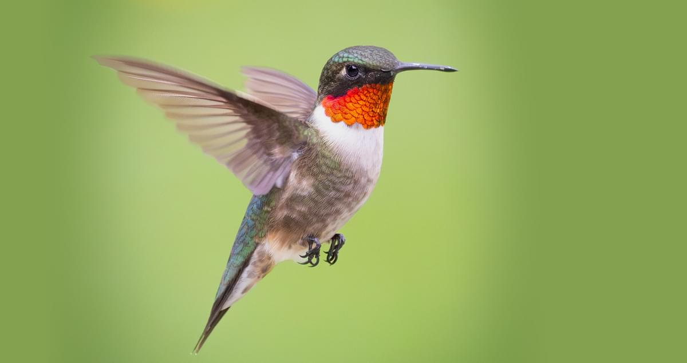
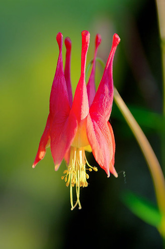
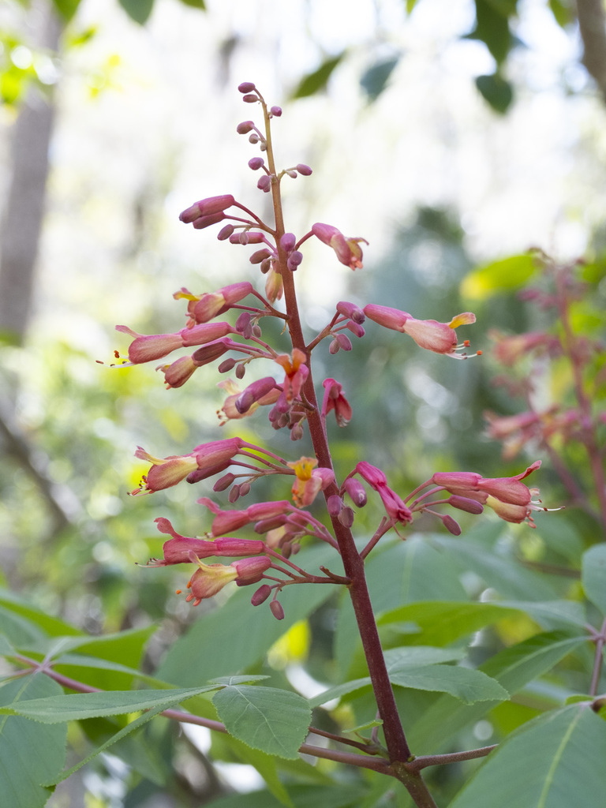

# Introduction

With warming temperatures due to anthropogenic climate change, bird migration times are shifting, and they are tending to migrate back to their breeding grounds earlier each year. Along with this ,flowers that certain migrating birds, like Ruby-throated Hummingbirds (Archilochus colubris), feed on may be changing the time of their first bloom due to climate change.

{fig-align="center" width="400"}

I want to investigate how a pollinating bird species, the Ruby-throated Hummingbird, has been shifting its migration patterns and how the appearances of two spring ephemeral species it prefers to feed on, Red Buckeye (Aesculus pavia) and columbine (Aquilegia canadensis), has changed (or not changed) over the past 7 years.

{fig-align="center" width="200"}

{fig-align="center" width="226"}

I predict that Ruby-throated Hummingbirds are migrating back earlier each year, and they are arriving at higher latitudes increasingly earlier than lower latitudes. Additionally, I suppose that the first sightings of these preferred flowers in the months that Ruby-throated Hummingbirds migrate back North will be earlier compared to previous years. Thus, the earlier migration of Ruby-throated Hummingbirds may by influenced by, or may be influencing, earlier flower bloom times.

# Materials and methods

1.  I installed leaflet, for making maps, along with rinat and rnpn to download data from iNaturalist and the US National Phenology Network, respectively. I then loaded my necessary libraries. I used dplyr to mutate and filter data, lubridate to parse date data, ggplot2 for plotting, and profvis to check code efficiency.

```{r, message=FALSE, warning=FALSE}

#install.packages("leaflet")
#install.packages("leaflet.extras")
#install.packages("rinat")
#install.packages("rnpn")
#install.packages("profvis")
library(leaflet)
library(leaflet.extras)
library(dplyr)
library(lubridate)
library(ggplot2)
library(rinat)
library(rnpn)

```

2.  I loaded my data from iNaturalist and the US National Phenology Network and joined my data into one set.

-   I repeated the below process of downloading iNaturalist observational data using the rinat package for each year from 2005 to 2025, saving each to an object, and combining species data to have a dataset for each year. The functions are commented out after running them once so that they do not start each time the code is run.

-   rb = Red Buckeye

-   cb = Columbine

-   taxon_name is set to each desired species, place_id is set to 1 for the United States, maxresults is set to 5000 to ensure all data is downloaded, and quality is set to research to ensure I get verified data

```{r, message=FALSE, warning=FALSE}

#rb2005 <- get_inat_obs(taxon_name = "Aesculus pavia", year = 2005, place_id = 1, maxresults = 5000, quality = "research")
#cb2005 <- get_inat_obs(taxon_name = "Aquilegia canadensis", year = 2005, place_id = 1, maxresults = 5000, quality = "research")

#fl_2005 <- rbind(rb2005, cb2005)
```

```{r, message=FALSE, warning=FALSE, echo=FALSE}

#rb2006 <- get_inat_obs(taxon_name = "Aesculus pavia", year = 2006, place_id = 1, maxresults = 5000, quality = "research")
#cb2006 <- get_inat_obs(taxon_name = "Aquilegia canadensis", year = 2006, place_id = 1, maxresults = 5000, quality = "research")

#fl_2006 <- rbind(rb2006, cb2006)

#rb2007 <- get_inat_obs(taxon_name = "Aesculus pavia", year = 2007, place_id = 1, maxresults = 5000, quality = "research")
#cb2007 <- get_inat_obs(taxon_name = "Aquilegia canadensis", year = 2007, place_id = 1, maxresults = 5000, quality = "research")

#fl_2007 <- rbind(rb2007, cb2007)

#rb2008 <- get_inat_obs(taxon_name = "Aesculus pavia", year = 2008, place_id = 1, maxresults = 5000, quality = "research")
#cb2008 <- get_inat_obs(taxon_name = "Aquilegia canadensis", year = 2008, place_id = 1, maxresults = 5000, quality = "research")

#fl_2008 <- rbind(rb2008, cb2008)

#rb2009 <- get_inat_obs(taxon_name = "Aesculus pavia", year = 2009, place_id = 1, maxresults = 5000, quality = "research")
#cb2009 <- get_inat_obs(taxon_name = "Aquilegia canadensis", year = 2009, place_id = 1, maxresults = 5000, quality = "research")

#fl_2009 <- rbind(rb2009, cb2009)

#rb2010 <- get_inat_obs(taxon_name = "Aesculus pavia", year = 2010, place_id = 1, maxresults = 5000, quality = "research")
#cb2010 <- get_inat_obs(taxon_name = "Aquilegia canadensis", year = 2010, place_id = 1, maxresults = 5000, quality = "research")

#fl_2010 <- rbind(rb2010, cb2010)

#rb2011 <- get_inat_obs(taxon_name = "Aesculus pavia", year = 2011, place_id = 1, maxresults = 5000, quality = "research")
#cb2011 <- get_inat_obs(taxon_name = "Aquilegia canadensis", year = 2011, place_id = 1, maxresults = 5000, quality = "research")

#fl_2011 <- rbind(rb2011, cb2011)

#rb2012 <- get_inat_obs(taxon_name = "Aesculus pavia", year = 2012, place_id = 1, maxresults = 5000, quality = "research")
#cb2012 <- get_inat_obs(taxon_name = "Aquilegia canadensis", year = 2012, place_id = 1, maxresults = 5000, quality = "research")

#fl_2012 <- rbind(rb2012, cb2012)

#rb2013 <- get_inat_obs(taxon_name = "Aesculus pavia", year = 2013, place_id = 1, maxresults = 5000, quality = "research")
#cb2013 <- get_inat_obs(taxon_name = "Aquilegia canadensis", year = 2013, place_id = 1, maxresults = 5000, quality = "research")

#fl_2013 <- rbind(rb2013, cb2013)

#rb2014 <- get_inat_obs(taxon_name = "Aesculus pavia", year = 2014, place_id = 1, maxresults = 5000, quality = "research")
#cb2014 <- get_inat_obs(taxon_name = "Aquilegia canadensis", year = 2014, place_id = 1, maxresults = 5000, quality = "research")

#fl_2014 <- rbind(rb2014, cb2014)

#rb2015 <- get_inat_obs(taxon_name = "Aesculus pavia", year = 2015, place_id = 1, maxresults = 5000, quality = "research")
#cb2015 <- get_inat_obs(taxon_name = "Aquilegia canadensis", year = 2015, place_id = 1, maxresults = 5000, quality = "research")

#fl_2015 <- rbind(rb2015, cb2015)

#rb2016 <- get_inat_obs(taxon_name = "Aesculus pavia", year = 2016, place_id = 1, maxresults = 5000, quality = "research")
#cb2016 <- get_inat_obs(taxon_name = "Aquilegia canadensis", year = 2016, place_id = 1, maxresults = 5000, quality = "research")

#fl_2016 <- rbind(rb2016, cb2016)

#rb2017 <- get_inat_obs(taxon_name = "Aesculus pavia", year = 2017, place_id = 1, maxresults = 5000, quality = "research")
#cb2017 <- get_inat_obs(taxon_name = "Aquilegia canadensis", year = 2017, place_id = 1, maxresults = 5000, quality = "research")

#fl_2017 <- rbind(rb2017, cb2017)

#rb2018 <- get_inat_obs(taxon_name = "Aesculus pavia", year = 2018, place_id = 1, maxresults = 5000, quality = "research")
#cb2018 <- get_inat_obs(taxon_name = "Aquilegia canadensis", year = 2018, place_id = 1, maxresults = 5000, quality = "research")

#fl_2018 <- rbind(rb2018, cb2018)

#rb2019 <- get_inat_obs(taxon_name = "Aesculus pavia", year = 2019, place_id = 1, maxresults = 5000, quality = "research")
#cb2019 <- get_inat_obs(taxon_name = "Aquilegia canadensis", year = 2019, place_id = 1, maxresults = 5000, quality = "research")

#fl_2019 <- rbind(rb2019, cb2019)

#rb2020 <- get_inat_obs(taxon_name = "Aesculus pavia", year = 2020, place_id = 1, maxresults = 5000, quality = "research")
#cb2020 <- get_inat_obs(taxon_name = "Aquilegia canadensis", year = 2020, place_id = 1, maxresults = 5000, quality = "research")

#fl_2020 <- rbind(rb2020, cb2020)

#rb2021 <- get_inat_obs(taxon_name = "Aesculus pavia", year = 2021, place_id = 1, maxresults = 5000, quality = "research")
#cb2021 <- get_inat_obs(taxon_name = "Aquilegia canadensis", year = 2021, place_id = 1, maxresults = 5000, quality = "research")

#fl_2021 <- rbind(rb2021, cb2021)

#rb2022 <- get_inat_obs(taxon_name = "Aesculus pavia", year = 2022, place_id = 1, maxresults = 5000, quality = "research")
#cb2022 <- get_inat_obs(taxon_name = "Aquilegia canadensis", year = 2022, place_id = 1, maxresults = 5000, quality = "research")

#fl_2022 <- rbind(rb2022, cb2022)

#rb2023 <- get_inat_obs(taxon_name = "Aesculus pavia", year = 2023, place_id = 1, maxresults = 5000, quality = "research")
#cb2023 <- get_inat_obs(taxon_name = "Aquilegia canadensis", year = 2023, place_id = 1, maxresults = 5000, quality = "research")

#fl_2023 <- rbind(rb2023, cb2023)

#rb2024 <- get_inat_obs(taxon_name = "Aesculus pavia", year = 2024, place_id = 1, maxresults = 5000, quality = "research")
#cb2024 <- get_inat_obs(taxon_name = "Aquilegia canadensis", year = 2024, place_id = 1, maxresults = 5000, quality = "research")

#fl_2024 <- rbind(rb2024, cb2024)

#rb2025 <- get_inat_obs(taxon_name = "Aesculus pavia", year = 2025, place_id = 1, maxresults = 5000, quality = "research")
#cb2025 <- get_inat_obs(taxon_name = "Aquilegia canadensis", year = 2025, place_id = 1, maxresults = 5000, quality = "research")

#fl_2025 <- rbind(rb2025, cb2025)

```

3.  I combined the datasets from each year into one whole set. I then converted this data into a csv, and loaded it into my environment as nat_flower to deisgnate data from iNaturalist. I filtered nat_flower to only include wild sightings of the selected species (captive_cultivated = "false").

```{r, message=FALSE, warning=FALSE}

#fl_all <- rbind(fl_2005, fl_2006, fl_2007, fl_2008, fl_2009, fl_2010, fl_2011, fl_2012, fl_2013, fl_2014, fl_2015, fl_2016, fl_2017, fl_2018, fl_2019, fl_2020, fl_2021, fl_2022, fl_2023, fl_2024, fl_2025)

#write.csv(fl_all, "data/fl_all.csv")

nat_flower <- read.csv("data/fl_all.csv")
nat_flower <- nat_flower %>%
  filter(captive_cultivated == "false")

```

4.  I then used the rnpn package to download data for the plant species from the National Phenology Network (which automatically saves as a csv). The species IDs were available through the NPN's website (Red Buckeye = 784, columbine = 147).

```{r, message=FALSE, warning=FALSE}

#npn_download_individual_phenometrics(
# request_source='Aubrey Monaco', 
# years=c(2005, 2006, 2007, 2008, 2009, 2010,2011,2012,2013,2014,2015,2016,2017,2018,2019,2020,2021,2022,2023,2024, 2025), 
# species_id=c(784, 147), 
# download_path="data/npn_flower.csv"
# )

npn_flower <- read.csv("data/npn_flower.csv")

```

5.  I then combined my iNaturalist and NPN data into one dataset.

```{r}

all_flower <- nat_flower %>% full_join(npn_flower)

```

6.  I used the Lubridate package to standardize the format all of the dates in my flower data. Then, I used this standardized data to create a year column, where I pulled the year from the dates, a year_day column, to transform the date into a day out of 365, and a month column to pull the month from the dates.

```{r, message=FALSE, warning=FALSE}

all_flower <- all_flower %>%
  mutate(observed_on = parse_date_time(observed_on, orders = c("mdy", "ydm", "dmy"))) %>%
  mutate(year = year(observed_on)) %>%
  mutate(year_day = yday(observed_on)) %>%
  mutate(month = month(observed_on))
 
```

7.  I found the mean date of first sightings of the selected flowers from 2000 to 2017 and from March to June (when these flowers bloom and ruby-throats migrate north; fl_early dataset) to compare data from the last 7 years. I separated sightings into 4 bands of latitude (in increments of approxiamtely 3, excepting 30 to 36, since there were so few observations).

```{r, message=FALSE, warning=FALSE}

fl_early <- all_flower %>%
  filter(year %in% c(2005, 2006, 2007, 2008, 2009, 2010, 2011, 2012, 2013, 2014, 2015, 2016, 2017) & month %in% c(3, 4, 5, 6))

fl_early_30 <- fl_early %>%
  filter(latitude > 30 & latitude < 36) %>%
  mutate(mean = mean(year_day, na.rm = TRUE))

fl_early_36 <- fl_early %>%
  filter(latitude > 36 & latitude < 42) %>%
  mutate(mean = mean(year_day, na.rm = TRUE))

fl_early_42 <- fl_early %>%
  filter(latitude > 42 & latitude < 45) %>%
  mutate(mean = mean(year_day, na.rm = TRUE))

fl_early_45 <- fl_early %>%
  filter(latitude > 45 & latitude < 48) %>%
  mutate(mean = mean(year_day, na.rm = TRUE))

fl_early1 <- fl_early_30 %>% full_join(fl_early_36)
fl_early2 <- fl_early_42 %>% full_join(fl_early_45)

fl_early_all <- fl_early1 %>% full_join(fl_early2)

#Checked each dataset for the mean bloom date

```

8.  I created the dataset to see trends between 2018 and 2025, and in months March to June. I added a column (mean0017) to this new dataset where I added the means of the fl_early observations based on latitude. I separated the 36 to 42 band into 30 to 36 since there were more new observations to compare this early data to. I also created a difference column, showing the difference in days of arrival between the 2015 and 2025 dataset and the 2000 to 2014 average using mean - mean0014.I rejoined all of these bands into one dataset to plot on a map.

```{r, message=FALSE, warning=FALSE}
flower_new <- all_flower %>%
  filter(year %in% c(2018, 2019, 2020, 2021, 2022, 2023, 2024, 2025) & month %in% c(3, 4, 5, 6)) %>%
  mutate(mean0017 = case_when(
                          latitude > 30 & latitude < 33 ~ 103.2473,
                          latitude > 33 & latitude < 36 ~ 103.2473,
                          latitude > 36 & latitude < 39 ~ 104.8421,
                          latitude > 39 & latitude < 42 ~ 104.8421,
                          latitude > 42 & latitude < 45 ~ 112.0147,
                          latitude > 45 & latitude < 48 ~ 118))

fl_30 <- flower_new %>%
  filter(latitude > 30 & latitude < 33) %>%
  mutate(mean = mean(year_day, na.rm = TRUE)) %>%
  mutate(difference = mean - mean0017)

fl_33 <- flower_new %>%
  filter(latitude > 33 & latitude < 36) %>%
  mutate(mean = mean(year_day, na.rm = TRUE)) %>%
  mutate(difference = mean - mean0017)

fl_36 <- flower_new %>%
  filter(latitude > 36 & latitude < 39) %>%
  mutate(mean = mean(year_day, na.rm = TRUE)) %>%
  mutate(difference = mean - mean0017)

fl_39 <- flower_new %>%
  filter(latitude > 39 & latitude < 42) %>%
  mutate(mean = mean(year_day, na.rm = TRUE)) %>%
  mutate(difference = mean - mean0017)

fl_42 <- flower_new %>%
  filter(latitude > 42 & latitude < 45) %>%
  mutate(mean = mean(year_day, na.rm = TRUE)) %>%
  mutate(difference = mean - mean0017)

fl_45 <- flower_new %>%
  filter(latitude > 45 & latitude < 50) %>%
  mutate(mean = mean(year_day, na.rm = TRUE)) %>%
  mutate(difference = mean - mean0017)

fl_1 <- fl_30 %>% full_join(fl_33)
fl_2 <- fl_36 %>% full_join(fl_39)
fl_3 <- fl_42 %>% full_join(fl_45)

fl_4 <- fl_1 %>% full_join(fl_2)

fl_new_all <- fl_3 %>%
  full_join(fl_4)

```

9.  I followed the same steps to find data for Ruby-throated Hummingbird migration and found their average arrival dates for various latitudes between 2000 and 2017 (since more data for this early period was needed). I used data from eBird and Journey North in addition to iNaturalist and the US National Phenology Network.

My eBird datasets can be found on figshare here:

-   1995-2021: <https://figshare.com/articles/dataset/eBird_rthhum_2010_2014/30535889?file=59303393>

-   2022-2025: <https://figshare.com/articles/dataset/eBird_rthhum_2015_2025/30535895?file=59303390>

Here is one example of my iNaturalist data download for Ruby-Throats:

```{r, message=FALSE, warning=FALSE}

#rth2005 <- get_inat_obs(taxon_name = "Archilochus colubris", year = 2005, place_id = 1, maxresults = 5000)

```

```{r, message=FALSE, warning=FALSE, echo=FALSE}

#rth2006 <- get_inat_obs(taxon_name = "Archilochus colubris", year = 2006, place_id = 1, maxresults = 5000)

#rth2007 <- get_inat_obs(taxon_name = "Archilochus colubris", year = 2007, place_id = 1, maxresults = 5000)

#rth2008 <- get_inat_obs(taxon_name = "Archilochus colubris", year = 2008, place_id = 1, maxresults = 5000)

#rth2009 <- get_inat_obs(taxon_name = "Archilochus colubris", year = 2009, place_id = 1, maxresults = 5000)

#rth2010 <- get_inat_obs(taxon_name = "Archilochus colubris", year = 2010, place_id = 1, maxresults = 5000)

#rth2011 <- get_inat_obs(taxon_name = "Archilochus colubris", year = 2011, place_id = 1, maxresults = 5000)

#rth2012 <- get_inat_obs(taxon_name = "Archilochus colubris", year = 2012, place_id = 1, maxresults = 5000)

#rth2013 <- get_inat_obs(taxon_name = "Archilochus colubris", year = 2013, place_id = 1, maxresults = 5000)

#rth2014 <- get_inat_obs(taxon_name = "Archilochus colubris", year = 2014, place_id = 1, maxresults = 5000)

#rth2015 <- get_inat_obs(taxon_name = "Archilochus colubris", year = 2015, place_id = 1, maxresults = 5000)

#rth2016 <- get_inat_obs(taxon_name = "Archilochus colubris", year = 2016, place_id = 1, maxresults = 5000)

#rth2017 <- get_inat_obs(taxon_name = "Archilochus colubris", year = 2017, place_id = 1, maxresults = 5000)

#rth2018 <- get_inat_obs(taxon_name = "Archilochus colubris", year = 2018, place_id = 1, maxresults = 10000)

#rth2019 <- get_inat_obs(taxon_name = "Archilochus colubris", year = 2019, place_id = 1, maxresults = 10000)

#rth2020 <- get_inat_obs(taxon_name = "Archilochus colubris", year = 2020, place_id = 1, maxresults = 10000)

#rth2021 <- get_inat_obs(taxon_name = "Archilochus colubris", year = 2021, place_id = 1, maxresults = 10000)

#rth2022 <- get_inat_obs(taxon_name = "Archilochus colubris", year = 2022, place_id = 1, maxresults = 10000)

#rth2023 <- get_inat_obs(taxon_name = "Archilochus colubris", year = 2023, place_id = 1, maxresults = 10000)

#rth2024 <- get_inat_obs(taxon_name = "Archilochus colubris", year = 2024, place_id = 1, maxresults = 10000)

#rth2025 <- get_inat_obs(taxon_name = "Archilochus colubris", year = 2025, place_id = 1, maxresults = 10000)

```

```{r, warning=FALSE, message=FALSE}

#Combined all iNat data into one data set for Ruby-Throats

#rth_nat <- rbind(rth2005, rth2006, rth2007, rth2008, rth2009, rth2010, rth2011, rth2012, rth2013, rth2014, rth2015, rth2016, rth2017, rth2018, rth2019, rth2020, rth2021, rth2022, rth2023, rth2024, rth2025)

#write.csv(rth_nat, "data/rth_nat.csv")

#NPN data download (Ruby-Throated Hummingbird = 352 (Species ID))

#npn_download_individual_phenometrics(
# request_source='Aubrey Monaco', 
# years=c(2005, 2006, 2007, 2008, 2009, 2010,2011,2012,2013,2014,2015,2016,2017,2018,2019,2020,2021,2022,2023, 2024, 2025), 
# species_id=c(352), 
# download_path="data/npn_rth.csv")

#Renamed latitude column for easier manipulation
npn_rth <- read.csv("data/npn_rth.csv")
npn_rth <- npn_rth %>%
  rename(Latitude = latitude)

```
Here's one example of my Journey North data download:
```{r}

library(rvest)

#jn_05 <- "https://journeynorth.org/sightings/querylist.html?season=spring&map=hummingbird-ruby-throated-first&year=2005&submit=View+Data"
#jn05 <- read_html(jn_05)
#jn05 <- jn05 %>%
 # html_elements("table") %>%
 # html_table()
#jn05 <- as.data.frame(jn05)

```

```{r, echo=FALSE, warning=FALSE, message=FALSE}

#jn_06 <- "https://journeynorth.org/sightings/querylist.html?season=spring&map=hummingbird-ruby-throated-first&year=2006&submit=View+Data"
#jn06 <- read_html(jn_06)
#jn06 <- jn06 %>%
 # html_elements("table") %>%
 # html_table()
#jn06 <- as.data.frame(jn06)

#jn_07 <- "https://journeynorth.org/sightings/querylist.html?season=spring&map=hummingbird-ruby-throated-first&year=2007&submit=View+Data"
#jn07 <- read_html(jn_07)
#jn07 <- jn07 %>%
 # html_elements("table") %>%
 # html_table()
#jn07 <- as.data.frame(jn07)

#jn_08 <- "https://journeynorth.org/sightings/querylist.html?season=spring&map=hummingbird-ruby-throated-first&year=2008&submit=View+Data"
#jn08 <- read_html(jn_08)
#jn08 <- jn08 %>%
 # html_elements("table") %>%
 # html_table()
#jn08 <- as.data.frame(jn08)

#jn_09 <- "https://journeynorth.org/sightings/querylist.html?season=spring&map=hummingbird-ruby-throated-first&year=2009&submit=View+Data"
#jn09 <- read_html(jn_09)
#jn09 <- jn09 %>%
 # html_elements("table") %>%
 #  html_table()
#jn09 <- as.data.frame(jn09)

#jn_10 <- "https://journeynorth.org/sightings/querylist.html?season=spring&map=hummingbird-ruby-throated-first&year=2010&submit=View+Data"
#jn10 <- read_html(jn_10)
#jn10 <- jn10 %>%
 # html_elements("table") %>%
 #  html_table()
#jn10 <- as.data.frame(jn10)

#jn_11 <- "https://journeynorth.org/sightings/querylist.html?season=spring&map=hummingbird-ruby-throated-first&year=2011&submit=View+Data"
#jn11 <- read_html(jn_11)
#jn11 <- jn11 %>%
 # html_elements("table") %>%
 #  html_table()
#jn11 <- as.data.frame(jn11)

#jn_12 <- "https://journeynorth.org/sightings/querylist.html?season=spring&map=hummingbird-ruby-throated-first&year=2005&submit=View+Data"
#jn12 <- read_html(jn_12)
#jn12 <- jn12 %>%
 # html_elements("table") %>%
 # html_table()
#jn12 <- as.data.frame(jn12)

#jn_13 <- "https://journeynorth.org/sightings/querylist.html?season=spring&map=hummingbird-ruby-throated-first&year=2013&submit=View+Data"
#jn13 <- read_html(jn_13)
#jn13 <- jn13 %>%
#  html_elements("table") %>%
#  html_table()
#jn13 <- as.data.frame(jn13)

#jn_14 <- "https://journeynorth.org/sightings/querylist.html?season=spring&map=hummingbird-ruby-throated-first&year=2014&submit=View+Data"
#jn14 <- read_html(jn_14)
#jn14 <- jn14 %>%
#  html_elements("table") %>%
#  html_table()
#jn14 <- as.data.frame(jn14)

#jn_15 <- "https://journeynorth.org/sightings/querylist.html?season=spring&map=hummingbird-ruby-throated-first&year=2015&submit=View+Data"
#jn15 <- read_html(jn_15)
#jn15 <- jn15 %>%
#  html_elements("table") %>%
#  html_table()
#jn15 <- as.data.frame(jn15)

#jn_16 <- "https://journeynorth.org/sightings/querylist.html?season=spring&map=hummingbird-ruby-throated-first&year=2016&submit=View+Data"
#jn16 <- read_html(jn_16)
#jn16 <- jn16 %>%
#  html_elements("table") %>%
#  html_table()
#jn16 <- as.data.frame(jn16)

#jn_17 <- "https://journeynorth.org/sightings/querylist.html?season=spring&map=hummingbird-ruby-throated-first&year=2017&submit=View+Data"
#jn17 <- read_html(jn_17)
#jn17 <- jn17 %>%
#  html_elements("table") %>%
#  html_table()
#jn17 <- as.data.frame(jn17)

#jn_18 <- "https://journeynorth.org/sightings/querylist.html?season=spring&map=hummingbird-ruby-throated-first&year=2018&submit=View+Data"
#jn18 <- read_html(jn_18)
#jn18 <- jn18 %>%
#  html_elements("table") %>%
#  html_table()
#jn18 <- as.data.frame(jn18)

#jn_19 <- "https://journeynorth.org/sightings/querylist.html?season=spring&map=hummingbird-ruby-throated-first&year=2019&submit=View+Data"
#jn19 <- read_html(jn_19)
#jn19 <- jn19 %>%
#  html_elements("table") %>%
#  html_table()
#jn19 <- as.data.frame(jn19)

#jn_20 <- "https://journeynorth.org/sightings/querylist.html?season=spring&map=hummingbird-ruby-throated-first&year=2020&submit=View+Data"
#jn20 <- read_html(jn_20)
#jn20 <- jn20 %>%
#  html_elements("table") %>%
#  html_table()
#jn20 <- as.data.frame(jn20)

#jn_21 <- "https://journeynorth.org/sightings/querylist.html?season=spring&map=hummingbird-ruby-throated-first&year=2021&submit=View+Data"
#jn21 <- read_html(jn_21)
#jn21 <- jn21 %>%
#  html_elements("table") %>%
#  html_table()
#jn21 <- as.data.frame(jn21)

#jn_22 <- "https://journeynorth.org/sightings/querylist.html?season=spring&map=hummingbird-ruby-throated-first&year=2022&submit=View+Data"
#jn22 <- read_html(jn_22)
#jn22 <- jn22 %>%
#  html_elements("table") %>%
#  html_table()
#jn22 <- as.data.frame(jn22)

#jn_23 <- "https://journeynorth.org/sightings/querylist.html?season=spring&map=hummingbird-ruby-throated-first&year=2023&submit=View+Data"
#jn23 <- read_html(jn_23)
#jn23 <- jn23 %>%
#  html_elements("table") %>%
#  html_table()
#jn23 <- as.data.frame(jn23)

#jn_24 <- "https://journeynorth.org/sightings/querylist.html?season=spring&map=hummingbird-ruby-throated-first&year=2024&submit=View+Data"
#jn24 <- read_html(jn_24)
#jn24 <- jn24 %>%
#  html_elements("table") %>%
#  html_table()
#jn24 <- as.data.frame(jn24)

#jn_25 <- "https://journeynorth.org/sightings/querylist.html?season=spring&map=hummingbird-ruby-throated-first&year=2025&submit=View+Data"
#jn25 <- read_html(jn_25)
#jn25 <- jn25 %>%
 # html_elements("table") %>%
 # html_table()
#jn25 <- as.data.frame(jn25)

#jn_table <- rbind(jn05, jn06, jn07, jn08, jn09, jn10, jn11, jn12, jn13, jn14, jn15, jn16, jn17, jn18, jn19, jn20, jn21, jn22, jn23, jn24, jn25)

```
Here I joined all of my data:
```{r}

#jn_table <- as.data.frame(jn_table)
#write.csv(jn_table, "data/jn_table.csv")
jn_table <- read.csv("data/jn_table.csv")

#Datasets from eBird
rth_0014 <- read.csv("data/RTH_1995_2021.csv")
rth_1525 <- read.csv("data/RTH_2022_2025.csv")

rth_ebird <- rth_0014 %>% full_join(rth_1525)

#Combined all data from iNaturalist, the NPN, and eBird
rth_inat <- read.csv("data/rth_nat.csv")
rth_inat <- rth_inat %>%
  rename(Latitude = latitude) %>%
  filter(captive_cultivated == "false" & quality_grade == "research")

rth_some <- rth_ebird %>% full_join(rth_inat)
rth_more <- rth_some %>% full_join(jn_table)

rth_most <- rth_some %>% full_join(rth_more)

rth_all <- rth_most %>% full_join(npn_rth)

```

```{r, message=FALSE, warning=FALSE}

ruby_throat <- rth_all %>%
  mutate(date_new = parse_date_time(Date, orders = c("mdy", "ydm", "dmy"))) %>%
  mutate(year_new = year(date_new)) %>%
  mutate(year_day = yday(date_new))

rth_early <- ruby_throat %>%
  filter(Year %in% c(2005, 2006, 2007, 2008, 2009, 2010, 2011, 2012, 2013, 2014, 2015, 2016) & Month %in% c(3,4,5))

rthearly30 <- rth_early %>%
  filter(Month == 3) %>%
  filter(Latitude > 29 & Latitude < 33) %>%
  mutate(mean = mean(year_day, na.rm = TRUE))

rthearly33 <- rth_early %>%
  filter(Month %in% c(3,4)) %>%
  filter(Latitude > 33 & Latitude < 36) %>%
  mutate(mean = mean(year_day, na.rm = TRUE))

rthearly36 <- rth_early %>%
   filter(Month == 4) %>%
  filter(Latitude > 36 & Latitude < 39) %>%
  mutate(mean = mean(year_day, na.rm = TRUE)) 

rthearly39 <- rth_early %>%
  filter(Month %in% c(4,5)) %>%
  filter(Latitude > 39 & Latitude < 43) %>%
  mutate(mean = mean(year_day, na.rm = TRUE)) 

rthearly42 <- rth_early %>%
  filter(Month == 5) %>%
  filter(Latitude > 42 & Latitude < 45) %>%
  mutate(mean = mean(year_day, na.rm = TRUE)) 

```

10. I then similarly created the Ruby-throat dataset for 2017-2025, but I added 3 more bands of latitude to account for the larger number of observations recorded at higher and lower latitudes. I again combined these bands into one dataset, and created a difference column, showing the difference in days of arrival between the new dataset and the 2005 to 2017 average using mean - mean0017.
  
```{r}              

rth_new_all <- ruby_throat %>%
  filter(Year %in% c(2018, 2019, 2020, 2021, 2022, 2023, 2024, 2025) & Month %in% c(3, 4, 5)) %>%
  mutate(mean0017 = case_when(Latitude > 30 & Latitude < 33 ~ 77,
                              Latitude > 33 & Latitude < 36 ~ 108.6842,
                              Latitude > 36 & Latitude < 39 ~ 114.75,
                              Latitude > 39 & Latitude < 42 ~ 130.5,
                              Latitude > 42 & Latitude < 45 ~ 139.3095
                              ))                          

rth_30 <- rth_new_all %>%
  filter(Month == 3) %>%
  filter(Latitude > 30 & Latitude < 33) %>%
  mutate(mean = mean(year_day, na.rm = TRUE)) %>%
  mutate(difference = mean - mean0017)

rth_33 <- rth_new_all %>%
  filter(Month %in% c(3,4)) %>%
  filter(Latitude > 33 & Latitude < 36) %>%
  mutate(mean = mean(year_day, na.rm = TRUE)) %>%
  mutate(difference = mean - mean0017)

rth_36 <- rth_new_all %>%
  filter(Month == 4) %>%
  filter(Latitude > 36 & Latitude < 39) %>%
  mutate(mean = mean(year_day, na.rm = TRUE)) %>%
  mutate(difference = mean - mean0017)

rth_39 <- rth_new_all %>%
  filter(Month == 4) %>%
  filter(Latitude > 39 & Latitude < 42) %>%
  mutate(mean = mean(year_day, na.rm = TRUE)) %>%
  mutate(difference = mean - mean0017)

rth_42 <- rth_new_all %>%
  filter(Month %in% c(4,5)) %>%
  filter(Latitude > 42 & Latitude < 45) %>%
  mutate(mean = mean(year_day, na.rm = TRUE)) %>%
  mutate(difference = mean - mean0017)

rth_1 <- rth_30 %>% full_join(rth_33)
rth_2 <- rth_36 %>% full_join(rth_39)
rth_3 <- rth_42 %>% full_join(rth_1)

rubythroat_all <- rth_2 %>% full_join(rth_3)

```

11. I then created color palettes using viridis scales and colorNumeric from the Leaflet package for my two maps, specifying to use the difference column in each dataset to map the colors to.

```{r}

cpal <- colorNumeric(palette = "viridis", domain = fl_new_all$difference, na.color = NA)

rpal <- colorNumeric(palette = "viridis", domain = rubythroat_all$difference, na.color = NA)
 
```

## Download and clean all required data

To download the Ruby-throated Hummingbird data from eBird on your own, visit: <https://media.ebird.org/catalog?birdOnly=true&taxonCode=rthhum>, filter by year (I did this in two separate actions \[1995-2021 and 2022-2025\] to ensure I could download all of the data), filter by location (United States), and download as a csv.

# Results

### Trends in Flower Blooms (2018 - 2025)

```{r}

leaflet(fl_new_all) %>%
  addProviderTiles(provider = "Esri") %>%
  addSimpleGraticule(interval = 3) %>%
  addCircleMarkers(~longitude, ~ latitude, radius = 5, stroke = FALSE, color = ~cpal(difference)) %>%
  addLegend(pal = cpal, values = ~difference, title = "Difference From Early Average (days)", position = "bottomleft") %>%
  setView(-94.5786, 39.0997, zoom = 4)

```

Dates for each latitude band:

-   30-33: April 19th (About 6 days later)

-   33-36: April 17th (About 4 days later)

-   36-39: April 17th (About 2 days later)

-   39-42: April 18th (About 4 days later)

-   42-45: April 20th (About 2 days earlier)

-   45-50: April 19th (About 9 days earlier)

### Trends in Ruby-Throated Hummingbird Sightings (2018 - 2025)

```{r}

leaflet(rubythroat_all) %>%
  addProviderTiles(provider = "Esri") %>%
  addSimpleGraticule(interval = 3) %>%
  addCircleMarkers(~Longitude, ~ Latitude, radius = 5, stroke = FALSE, color = ~rpal(difference)) %>%
  addLegend(pal = rpal, values = ~difference, title = "Difference From Early Average (days)", position = "bottomleft") %>%
  setView(-94.5786, 39.0997, zoom = 4)

```

Dates for each latitude band:

-   30-33: March 20th (About 2 days later)

-   33-36: April 13th (About 6 days earlier)

-   36-39: April 19th (About 6 days earlier)

-   39-42: April 27th (About the same (About 14 days earlier)

-   42-45: May 17th (About 2 days earlier)

### Average Bloom Time of Columbine and Red Buckeye (2018 - 2025)

```{r}

ggplot() + geom_point(data = fl_new_all, aes(x = mean, y = latitude)) + geom_smooth(data = fl_new_all, aes(x = mean, y = latitude), method = "lm", color = "darkred") + labs(title = "Average Bloom Time of Columbine and Red Buckeye", x = "Mean Bloom Date (Year Days)", y = "Latitude") + theme(plot.title = element_text(family = "serif", size = 12), axis.title = element_text(family = "serif", size = 10), panel.background = element_blank(), panel.grid = element_line(color = "lightblue"))

```

### Average First Sighting Date of Ruby-throated Hummingbirds (2018 - 2025)

```{r}

ggplot() + geom_point(data = rubythroat_all, aes(x = mean, y = Latitude)) + geom_smooth(data = rubythroat_all, aes(x = mean, y = Latitude), method = "lm", color = "darkblue") + labs(title = "Average First Sighting Date of Ruby-throated Hummingbirds", x = "Mean Sighting Date (Year Days)", y = "Latitude") + theme(plot.title = element_text(family = "serif", size = 12), axis.title = element_text(family = "serif", size = 10), panel.background = element_blank(), panel.grid = element_line(color = "pink"))

```

### Observation Locations of Flowers

```{r}

leaflet(all_flower)%>%
  addProviderTiles(provider = "Esri") %>%
  setView(-85.7664, 38.2469, zoom = 4) %>%
  addHeatmap()

```

### Observation Locations of Ruby-throats

```{r}

leaflet(ruby_throat)%>%
  addProviderTiles(provider = "Esri") %>%
  setView(-85.7664, 38.2469, zoom = 4) %>%
  addHeatmap(lng = ruby_throat$Longitude, lat = ruby_throat$Latitude)

```

# Conclusions

Trends for the preferred flowers have shown that its timing of first observations have changed from the 2000-2017 average. At the highest latitudes, there is a pattern of earlier sightings each year. But for latitudes between 30 and 39, flowers have been sighted later than in previous years. Since these flowers are spring ephemerals, warmer winter temperatures, or more extreme heat in spring and summer, may cause this trend, as these flowers will not bloom under extreme heat, or until they have gone through a period of sufficient cooling.

Similarly, the average first observation date for Ruby-throated hummingbirds has been generally shifting earlier with increasing latitudes. But similarly to the flower trends, the observations at lower latitudes are happening later on average. This may be due to the experience of more mild winters.

These trends do somewhat align. All flower bloom times occur around or before the average date of Ruby-throat sighting. Ruby-throats thus may move back earlier, especially to higher latitudes, since their food is available.

It is important to note, though, that this dataset is relatively small and data used to acquire average arrival/bloom dates for 2005 to 2014 was sparse. Additionally, since this data is collected from citizen science projects, the data may be more biased towards urban areas, and its distribution is not even. As shown in the heatmap, observations do tend to be concentrated in urban areas. For Ruby-throats, the data was more plentiful for higher latitudes.

# References

-   Coffey, M. L., & Simons, A. M. (2025). The spatial distribution of a hummingbird‐pollinated plant is not strongly influenced by hummingbird abundance. American Journal of Botany, 112(5), e70034. <https://doi.org/10.1002/ajb2.70034>

-   Correa-Lima, A. P. A., Varassin, I. G., Barve, N., & Zwiener, V. P. (2019). Spatio-temporal effects of climate change on the geographical distribution and flowering phenology of hummingbird-pollinated plants. Annals of Botany, 124(3), 389–398. <https://doi.org/10.1093/aob/mcz079>

-   Courter, J. R., Johnson, R. J., Bridges, W. C., & Hubbard, K. G. (2013). Assessing migration of Ruby-throated Hummingbirds ( Archilochus colubris ) at broad spatial and temporal scales. The Auk, 130(1), 107–117. <https://doi.org/10.1525/auk.2012.12058>

-   Delayed flowering phenology of red-flowering plants in response to hummingbird migration: Current Biology. (n.d.). Retrieved November 12, 2025, from <https://www.cell.com/current-biology/fulltext/S0960-9822(25)00347-1?_returnURL=https%3A%2F%2Flinkinghub.elsevier.com%2Fretrieve%2Fpii%2FS0960982225003471%3Fshowall%3Dtrue>

-   Ruby-throated Hummingbird. (n.d.). Retrieved November 12, 2025, from <https://www.fs.usda.gov/wildflowers/pollinators/pollinator-of-the-month/ruby-throated_hummingbird.shtml>

Thanks for checking out my web site!
